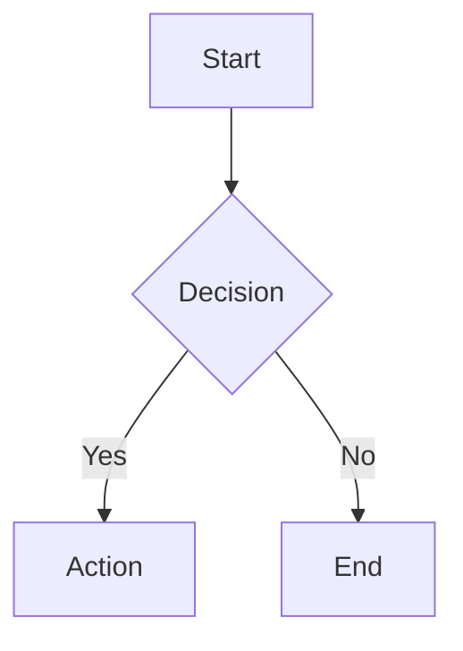

# Obsidian Flavored Markdown (OFM) — Syntax Reference

Obsidian extends standard Markdown with its own syntax. Use this when writing or generating note content.

---

## Wikilinks

```markdown
[[Note Name]]                    # basic internal link
[[Note Name|Display Text]]       # with custom display text
[[Note Name#Heading]]            # link to specific heading
[[Note Name#^blockid]]           # link to a specific block
[[Note Name|]]                   # display only the last part after /

![[Note Name]]                   # embed entire note inline
![[image.png]]                   # embed image
![[image.png|300]]               # embed with width
![[Note Name#Heading]]           # embed section
![[Note Name#^blockid]]          # embed specific block
![[audio.mp3]]                   # embed audio
![[video.mp4]]                   # embed video
![[file.pdf]]                    # embed PDF
```

---

## Tags

```markdown
#tag                             # simple tag
#nested/tag                      # nested tag (shows hierarchy in tag pane)
#multi-word-tag                  # hyphens allowed, no spaces
```

Tags in frontmatter:
```yaml
tags:
  - project
  - active
  - nested/subtag
```

---

## Callouts

```markdown
> [!note]
> Default note callout.

> [!note] Custom Title
> Callout with a title.

> [!tip]+ Expandable (open by default)
> Content here.

> [!warning]- Collapsible (closed by default)
> Content here.
```

**Available types:**
- `note` — default blue
- `abstract` / `summary` / `tldr`
- `info`
- `tip` / `hint` / `important`
- `success` / `check` / `done`
- `question` / `help` / `faq`
- `warning` / `caution` / `attention`
- `failure` / `fail` / `missing`
- `danger` / `error`
- `bug`
- `example`
- `quote` / `cite`

---

## Tasks

```markdown
- [ ] Open task
- [x] Completed task
- [/] In progress
- [-] Cancelled
- [>] Deferred / forwarded
- [!] Important
- [?] Question
- [*] Star / favorite
```

---

## Frontmatter (YAML Properties)

```yaml
---
title: "Note Title"
aliases:
  - "alternate name"
  - "short name"
tags:
  - project
  - active
created: 2026-04-15
modified: 2026-04-19
status: "draft"
priority: 1
due: 2026-05-01
published: false
related:
  - "[[OtherNote]]"
  - "[[AnotherNote]]"
---
```

Property types supported natively in Obsidian:
- `text` — plain string
- `number` — numeric value
- `checkbox` — boolean true/false
- `date` — ISO date `YYYY-MM-DD`
- `datetime` — `YYYY-MM-DDTHH:MM`
- `list` — array of strings or wikilinks

---

## Headings

```markdown
# H1
## H2
### H3
#### H4
##### H5
###### H6
```

---

## Formatting

```markdown
**bold**
*italic*
~~strikethrough~~
==highlight==
`inline code`
```

---

## Code Blocks

````markdown
```python
def hello():
    print("Hello")
```
````

---

## Math (LaTeX)

```markdown
Inline: $E = mc^2$

Block:
$$
\sum_{i=1}^{n} x_i
$$
```

---

## Block IDs (for block embeds)

```markdown
A paragraph of text. ^my-block-id

- A list item ^list-item-id
```

Reference: `[[Note#^my-block-id]]`

---

## Tables

```markdown
| Column 1 | Column 2 | Column 3 |
|----------|----------|----------|
| Cell     | Cell     | Cell     |
| Cell     | **Bold** | `code`   |
```

---

## Mermaid Diagrams

````markdown

````

---

## Canvas Files (.canvas)

Canvas files are JSON. Use `obsidian create name="MyCanvas.canvas"` to create one.
Basic structure:
```json
{
  "nodes": [
    {"id": "1", "type": "text", "text": "Hello", "x": 0, "y": 0, "width": 200, "height": 100},
    {"id": "2", "type": "file", "file": "Notes/MyNote.md", "x": 300, "y": 0, "width": 400, "height": 300}
  ],
  "edges": [
    {"id": "e1", "fromNode": "1", "toNode": "2"}
  ]
}
```

---

## Dataview Queries (requires Dataview plugin)

````markdown
```dataview
TABLE status, due FROM #project
WHERE status != "done"
SORT due ASC
```

```dataview
LIST FROM "Projects" WHERE contains(tags, "active")
```

```dataviewjs
const pages = dv.pages("#project").where(p => p.status !== "done");
dv.table(["Name", "Status"], pages.map(p => [p.file.link, p.status]));
```
````

---

## Templater Syntax (requires Templater plugin)

```markdown
# <% tp.file.title %>

Created: <% tp.date.now("YYYY-MM-DD") %>
Modified: <% tp.file.last_modified_date("YYYY-MM-DD") %>

<%* 
const name = await tp.system.prompt("Enter name");
tR += `Hello, ${name}!`;
%>
```

---

## File Naming Conventions

| Pattern | Use case |
|---|---|
| `YYYY-MM-DD` | Daily notes, dated entries |
| `YYYY-MM-DD HH-MM` | Timestamped notes |
| `Project Name` | Plain title (most common) |
| `MOC - Topic` | Map of Content notes |
| `@ Person Name` | People notes (common in PKM) |
| `+ Resource Title` | Reference/resource notes |
